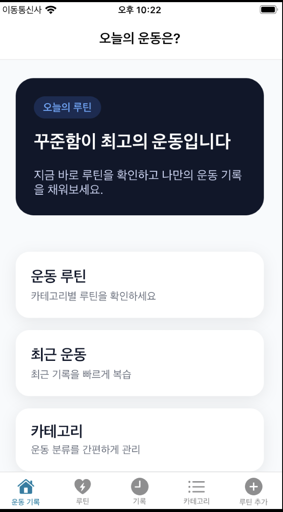
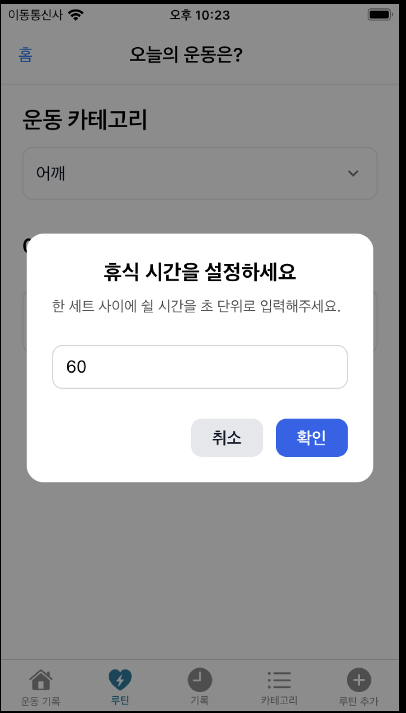
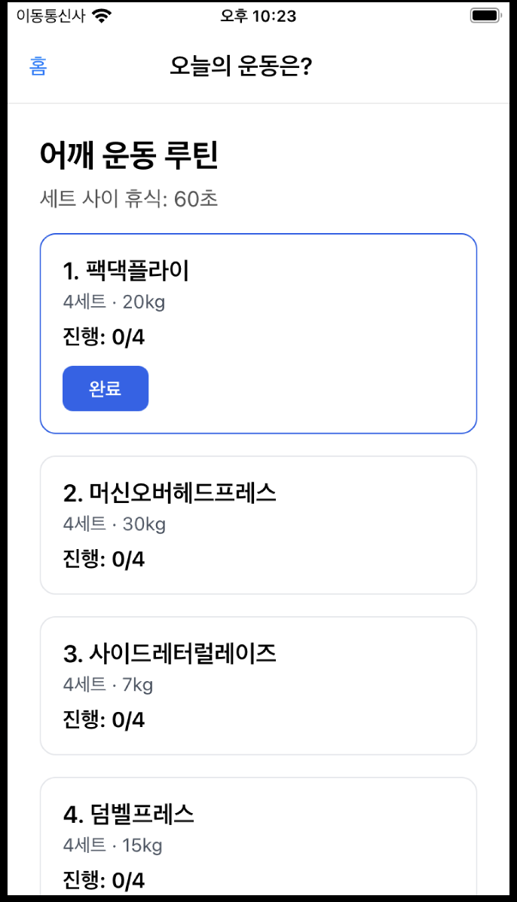
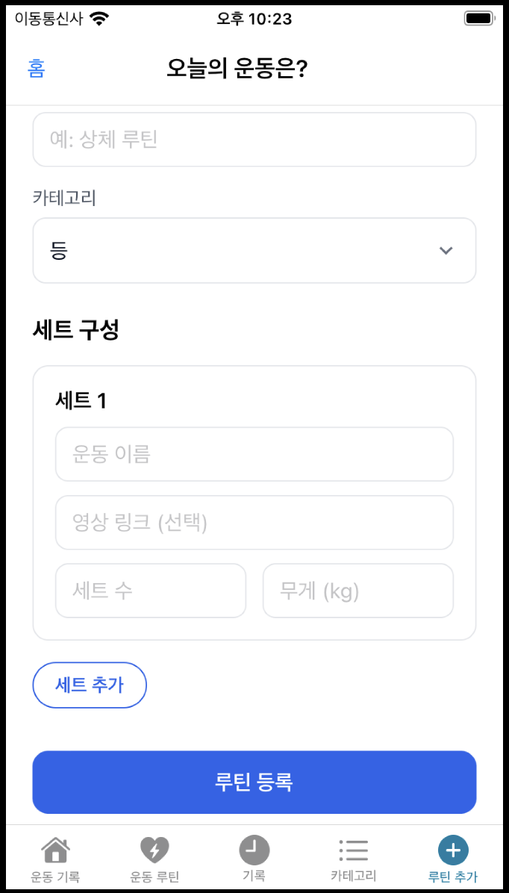
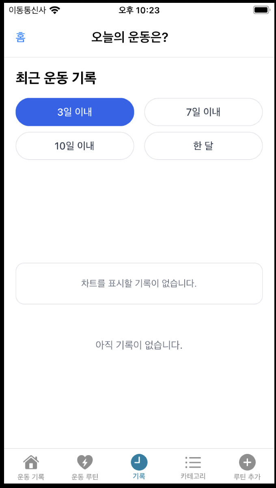

# Ji Healthcare

Expo + React Native 기반의 운동 루틴/기록 앱입니다.

## 프로젝트 상태

- Status: In Progress (WIP)
- 현재는 핵심 기능 구현/정리 단계이며 UI/기능이 계속 업데이트됩니다.

## 주요 기능

- 루틴 조회 및 카테고리별 필터링
- 루틴 등록 (세트/무게/유튜브 링크 포함)
- 운동 진행 화면 (세트 카운트, 휴식 타이머, 완료 처리)
- 운동 기록 조회 및 기간별 차트
- 카테고리 추가/삭제

## 기술 스택

- Expo 54, React Native 0.81, TypeScript
- expo-router (파일 기반 라우팅)
- @tanstack/react-query (서버 상태 관리)
- Supabase (데이터 저장/조회)
- ji-type-schema (입력 정규화/유효성 검사)

## 시작하기

### 1) 요구사항

- Node.js 18+

### 2) 설치

```bash
npm install
```

### 3) 실행

```bash
npm run start
```

플랫폼별 실행:

```bash
npm run android
npm run ios
npm run web
```

### 4) 린트

```bash
npm run lint
```

## 환경 설정

Supabase 연결에 필요한 환경 변수는 로컬 `.env`에서 관리합니다.

현재 서비스 계층은 Supabase 테이블을 직접 조회합니다.

- `categories`
- `routines`
- `routine_items`
- `records`

RLS를 사용하는 경우 위 테이블에 대해 앱의 사용 방식에 맞는 `select/insert/update/delete` 정책이 필요합니다.

## 프로젝트 구조

```text
app/                 # 라우트(화면) 계층
components/          # UI 컴포넌트
hooks/               # ViewModel/Query/Mutation 훅
service/             # API 호출 계층
schema/              # ji-type-schema 스키마/입력 검증
interface/           # 타입 정의
utils/               # 공통 유틸
constants/           # 상수
```

## 아키텍처 가이드

MVVM에 가까운 구조를 지향합니다.

- View: `app/*`, `components/*`
- ViewModel: `hooks/use*ViewModel.ts` (예: `hooks/useAddRoutineViewModel.ts`)
- Model/Data: `service/*`, `schema/*`, `interface/*`, `lib/supabase.ts`

화면은 렌더링에 집중하고, 상태/액션/검증 로직은 훅으로 분리합니다. 데이터 접근은 `service/*`에서 Supabase로 처리합니다.

## 유효성 검사 정책

- `ji-type-schema`를 사용해 입력값을 정규화(`trim`, 숫자 변환 등) 후 검증합니다.
- 현재 등록(create) 흐름 중심으로 적용되어 있습니다.
- 예시 파일:
  - `schema/routine.schema.ts`
  - `schema/category.schema.ts`
  - `service/routineService.ts`
  - `service/categoryService.ts`

## Current UI (WIP)

<p align="center">
  
  
  
</p>
<p align="center">
  
  
</p>

## Roadmap

- 루틴/카테고리 수정(편집) UX 고도화
- 입력 유효성 검사 범위 확장 (수정/기타 입력 경로)
- 에러/로딩 상태 UX 일관화
- 테스트 코드 및 문서 보강
