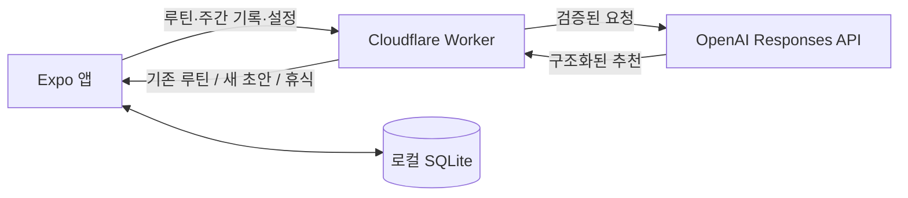
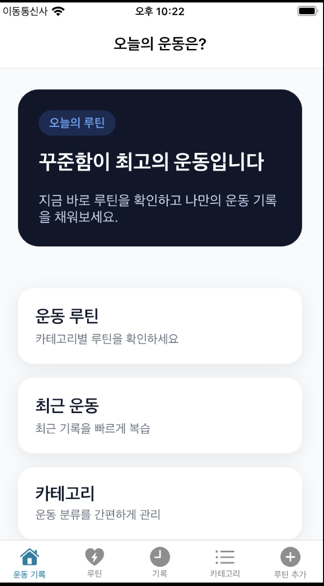
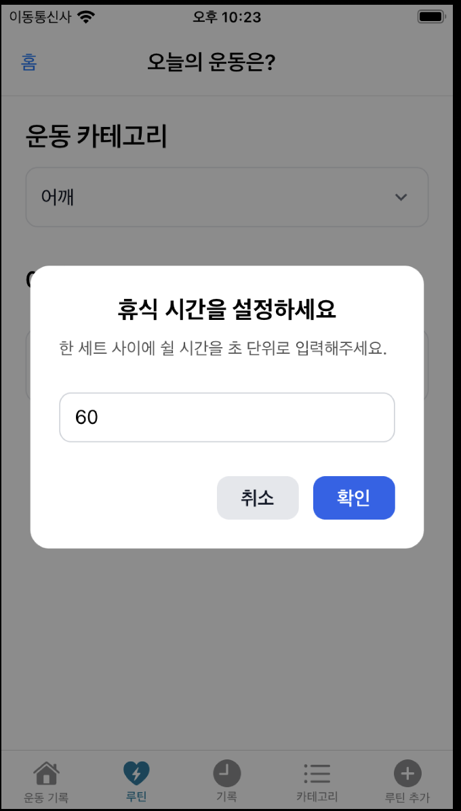
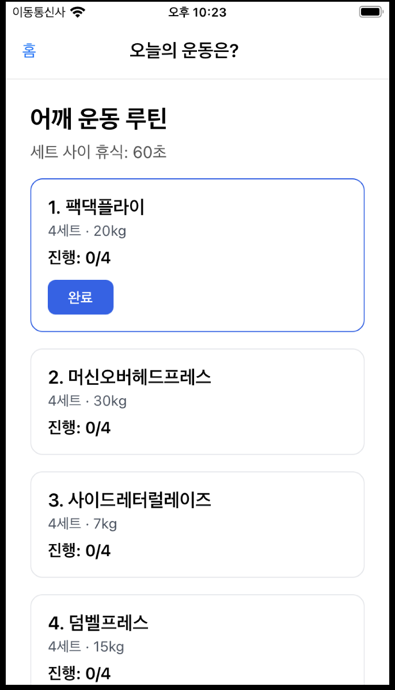
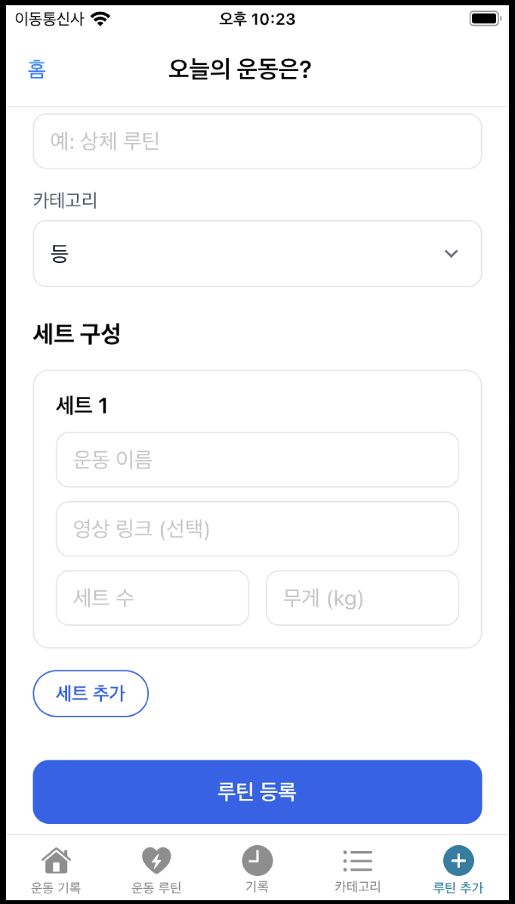
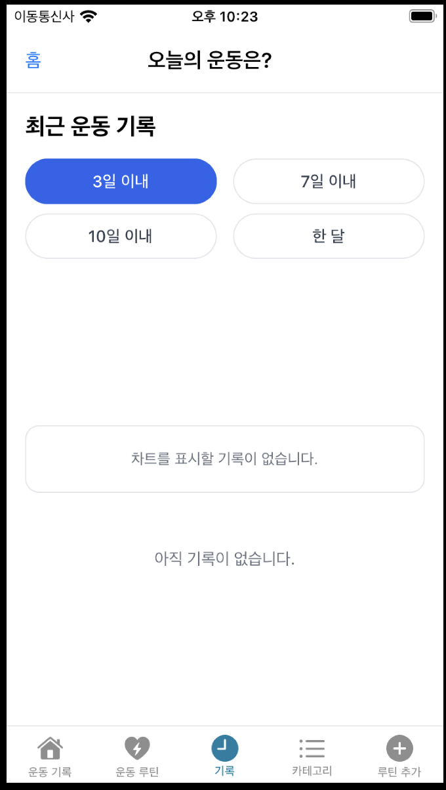

# Ji Healthcare

개인 운동 루틴을 구성하고 수행 기록을 관리하며, 최근 기록과 운동 환경을 바탕으로 AI 추천을 받을 수 있는 React Native 앱입니다.

이 프로젝트는 개인 사용을 목적으로 만들었습니다. 루틴 실행 중 앱이 백그라운드로 전환되거나 날짜가 바뀌는 실제 모바일 환경에서도 기록과 타이머가 정확하게 동작하도록 데이터 보존과 회귀 검증에 중점을 두었습니다.

## 주요 기능

- 카테고리별 운동 루틴 등록·수정·조회
- 세트 진행, 휴식 타이머, 완료 기록 저장
- 완료 당시 운동 항목·세트·무게 상세 조회
- 기간별 운동 기록과 차트 조회
- 사용하지 않는 카테고리 보관·복원
- 목표, 운동 장소, 시간, 장비를 반영한 AI 운동 추천
- 기존 루틴 추천, 새 루틴 초안 편집·등록, 휴식 제안

## 기술적 문제 해결

### 로컬 데이터 보존

SQLite 스키마를 버전별 마이그레이션으로 관리합니다. DB v3에서는 카테고리 보관 상태를, v4에서는 완료 기록의 운동 항목 스냅샷을 추가했습니다. 기존 루틴, 기록, AI 코치 설정을 유지하도록 트랜잭션과 업그레이드 경로를 검증했습니다.

### 모바일 생명주기 대응

휴식 타이머는 단순 interval 횟수가 아니라 종료 시각을 기준으로 남은 시간을 계산합니다. 앱이 잠금 또는 백그라운드 상태에 머문 뒤 복귀해도 실제 경과 시간이 반영됩니다. 날짜 기반 통계도 앱 복귀와 자정 경계에서 현재 로컬 날짜로 갱신합니다.

### 기록 중복과 화면 이탈 방지

운동 완료 기록을 저장하는 동안 중복 요청과 화면 이탈을 차단합니다. 저장 실패 후에는 사용자가 머무르거나 기록을 포기하고 나갈 수 있으며, 재시도 과정에서도 같은 기록이 중복 생성되지 않도록 검증합니다.

### AI 호출 경계

앱은 Cloudflare Worker를 통해 OpenAI Responses API를 호출합니다. OpenAI API 키는 Worker Secret에만 저장하며, Worker는 요청 크기, 호출 빈도, 입력과 구조화된 응답을 검증합니다. AI가 만든 새 루틴은 자동 저장하지 않고 사용자가 검토·수정한 뒤 명시적으로 등록합니다.


```mermaid
flowchart LR
    App[Expo 앱] -->|루틴·주간 기록·설정| Worker[Cloudflare Worker]
    Worker -->|검증된 요청| OpenAI[OpenAI Responses API]
    OpenAI -->|구조화된 추천| Worker
    Worker -->|기존 루틴 / 새 초안 / 휴식| App
    App <--> SQLite[(로컬 SQLite)]
```

## 기술 스택

| 영역 | 기술 |
| --- | --- |
| 앱 | Expo 57, React Native 0.86, React 19, TypeScript 6 |
| 라우팅·상태 | Expo Router, TanStack Query |
| 로컬 데이터 | Expo SQLite, 버전형 마이그레이션 |
| 입력 검증 | ji-type-schema, 서비스 경계 검증 |
| AI 백엔드 | Cloudflare Workers, OpenAI Responses API |
| 품질 | Jest, jest-expo, ESLint, TypeScript, GitHub Actions |
| 빌드 | EAS Build, Android/iOS JS export 검사 |

## 구조

```text
app/          화면과 라우트
components/   재사용 UI
hooks/        화면 상태와 사용자 동작
schema/       입력 정규화와 유효성 검사
service/      SQLite 및 Worker 접근
lib/          데이터베이스 초기화와 마이그레이션
worker/       AI 요청 검증과 OpenAI 호출
tests/        정상·경계·실패 회귀 테스트
```

화면은 렌더링, hooks는 상태와 동작, schema는 검증, service와 `lib/database.ts`는 데이터 접근을 담당합니다.

## 실행 방법

### 요구사항

- Node.js 22.17.0 (`.nvmrc` 기준)
- npm
- iOS 또는 Android 개발 환경

```bash
npm ci
cp .env.example .env
npm run start
```

플랫폼별 실행:

```bash
npm run android
npm run ios
npm run web
```

## AI 코치 로컬 설정

개인용 Worker 비밀값 파일을 준비합니다. 실제 값은 Git에 포함하지 않습니다.

```bash
cp worker/.dev.vars.example worker/.dev.vars
npm run worker:dev
```

앱의 `.env`에는 로컬 Worker 주소와 Worker에 설정한 개인 접근 토큰을 입력합니다. 이 토큰 방식은 개인 기기 사용을 위한 호출 구분 장치이며 다중 사용자 인증을 제공하지 않습니다. 자세한 설정과 데이터 제한은 [AI 운동 코치 문서](./docs/ai-workout-coach.md)를 참고하세요.

## 검증

```bash
npm run check       # 린트, 타입 검사, 단위·회귀 테스트
npm run test:ci     # 커버리지 수집
npm run build:check # Android/iOS JS 번들 검사
```

자동 테스트는 다음과 같은 경계 상황을 포함합니다.

- 소수점 무게 입력 보존
- 앱 백그라운드 전환 후 휴식 시간 계산
- 기록 저장 실패·재시도·화면 이탈
- 월말·연말·자정 전후 날짜 갱신
- 카테고리 보관·복원과 참조 데이터 보호
- SQLite v2 → v4 마이그레이션 롤백과 데이터 보존
- AI 요청·응답 계약과 Worker 오류 처리

GitHub Actions는 push와 PR에서 설치, 린트, 타입 검사, 테스트, Android/iOS JS export를 실행합니다. EAS 네이티브 빌드는 수동 워크플로로 분리되어 있습니다.

## 현재 범위와 한계

- 개인 기기 사용을 전제로 하며 회원가입과 다중 사용자 인증은 구현하지 않았습니다.
- 운동 기록에는 당시 실제 반복 횟수, 통증, 회복 상태가 포함되지 않습니다.
- 실제 기기 SQLite 업그레이드, 알림, 장시간 백그라운드 동작은 릴리스 전 수동 확인이 필요합니다.
- 자동 검사는 네이티브 스토어 빌드와 실제 기기 동작을 대신하지 않습니다.

## 화면

<p align="center">
  
  
  
</p>
<p align="center">
  
  
</p>

## 작업 및 배포 문서

- [프로젝트 하네스](./docs/harness/README.md)
- [테스트 절차와 기기 시나리오](./docs/harness/testing.md)
- [EAS 배포 절차](./docs/harness/deployment.md)
- [저장소 작업 규칙](./AGENTS.md)
